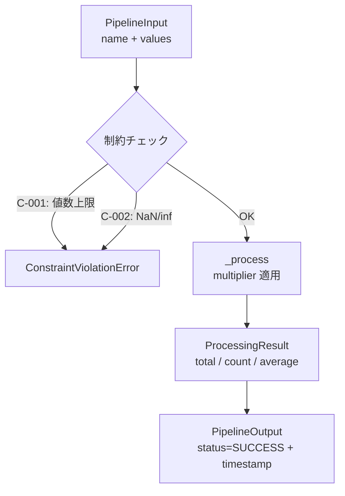

````markdown
# アーキテクチャ（Architecture）

## 目的

責務境界を明確にし、実装・テスト・監査を容易にする。

## モジュール責務

```
src/my_package/
├─ core/          型定義、例外、設定管理（最下層・依存ゼロ）
│   ├─ types.py       Status, PipelineInput, ProcessingResult, PipelineOutput
│   ├─ exceptions.py  DomainError 階層（ValidationError, ConfigError, ConstraintViolationError）
│   └─ config.py      PipelineConfig, load_config()（TOML ローダー）
├─ domain/        ドメインロジック（制約チェック、パイプライン処理）
│   ├─ constraints.py  check_constraints()（C-001: 最大値数, C-002: NaN/inf 禁止）
│   └─ pipeline.py     Pipeline クラス（入力→制約→処理→出力）
```

テンプレート共通モジュール（`src/` 直下）:

```
src/
├─ observability/  OpenTelemetry 計装（オプショナル。OTel SDK 未インストール時は no-op）
├─ sample/         Design by Contract のサンプル実装（テンプレート参考用）
```

<!-- project-config.yml の modules に合わせてモジュールを追加する -->

### core/

- **types.py** — ドメイン型定義。すべて frozen dataclass で不変条件を `__post_init__` で検証（Design by Contract）
  - `Status`: パイプラインの実行状態（PENDING / RUNNING / SUCCESS / FAILED）
  - `PipelineInput`: 入力データ（name は空不可、values は1要素以上）
  - `ProcessingResult`: 処理結果（total ≥ 0、count > 0、average = total/count）
  - `PipelineOutput`: 出力データ（status は SUCCESS か FAILED、UTC タイムスタンプ付き）
- **exceptions.py** — ドメイン例外階層
  - `DomainError` → `ValidationError` / `ConfigError` / `ConstraintViolationError`
  - `ConstraintViolationError`: 制約 ID と詳細を保持し、フェイルクローズ（P-010）を実現
- **config.py** — TOML 設定読み込み
  - `PipelineConfig`: max_values（正の整数）、multiplier（正の実数）、output_dir
  - `load_config()`: TOML ファイルを読み込み PipelineConfig を返す（不正値は ConfigError）

### domain/

- **constraints.py** — 入力制約の検証
  - `check_constraints()`: C-001（値数上限）、C-002（NaN/inf 禁止）を評価
  - 違反時は `ConstraintViolationError` を送出（フェイルクローズ）
- **pipeline.py** — MVP パイプライン
  - `Pipeline.run()`: 入力→制約チェック→処理→出力の一連フローを実行

## データフロー



### CLI 実行フロー

```
scripts/run_pipeline.py --config configs/pipeline_default.toml
       │
       ▼
  load_config() → PipelineConfig
       │
       ▼
  Pipeline(config).run(input_data) → PipelineOutput
       │
       ▼
  exit code 0 (SUCCESS) / 1 (エラー)
```

## 依存ルール

| モジュール     | 依存してよい     | 依存禁止          |
| -------------- | ---------------- | ----------------- |
| core           | （なし：最下層） | 他の全モジュール  |
| domain         | core             | observability, sample |
| observability  | （外部: OTel SDK） | core, domain   |
| sample         | （なし）         | core, domain      |

<!-- 必要に応じて追加 -->

## 制約仕様（N-002）

| ID    | 制約名         | 内容                           | 違反時の動作              |
| ----- | -------------- | ------------------------------ | ------------------------- |
| C-001 | 最大入力値数   | `len(values) ≤ max_values`     | ConstraintViolationError  |
| C-002 | 値範囲チェック | `values` に NaN/inf を許容しない | ConstraintViolationError |

## 不変条件

- 禁止操作を実装しない（P-001）
- 判断不能時は安全側に倒す（P-010: フェイルクローズ）
- 制約は常に優先され、ドメインロジックが回避できない

## 設計論点（必要に応じて ADR）

- **Design by Contract**: すべてのドメイン型は frozen dataclass + `__post_init__` による不変条件検証を採用（N-002）
- **フェイルクローズ（P-010）**: 制約違反時は `ConstraintViolationError` を送出し、処理を中断する
- **設定の外部化**: アプリケーション設定は TOML ファイルで管理し、コードに埋め込まない
---

## kashio-kintal アーキテクチャ（Next.js アプリ）

### 技術スタック

- **Next.js 16 App Router**（TypeScript）+ Supabase（PostgreSQL + Auth）+ Vercel
- メール送信: Resend

### モジュール責務

```
kashio-kintal/src/
├─ lib/
│   ├─ supabase/           Supabase クライアント（client.ts / server.ts）
│   ├─ auth.ts             requireRole() — ロールアクセス制御（サーバー専用）
│   ├─ attendance-utils.ts 勤怠集計純関数・型定義（サーバー/クライアント共有）
│   ├─ attendance.ts       勤怠 DB アクセス（サーバー専用）
│   ├─ punch-utils.ts      打刻ユーティリティ純関数・型定義（サーバー/クライアント共有）
│   └─ punch.ts            打刻 DB アクセス（サーバー専用）
├─ app/
│   ├─ (admin)/            管理画面（owner/manager/sharoushi）
│   │   ├─ attendance/daily/    日別ビュー（B-003）
│   │   ├─ attendance/staff/    人別ビュー（B-004）
│   │   └─ punch-ipad/         iPad打刻（B-002）
│   └─ (staff)/            スタッフ画面
│       └─ punch/store/    スマホQR打刻（B-001）
```

### 依存ルール

| モジュール | サーバー専用 | クライアント共有可 | 備考 |
| --- | --- | --- | --- |
| `attendance.ts` / `punch.ts` | ✅ | ❌ | supabase/server 依存のため |
| `attendance-utils.ts` / `punch-utils.ts` | - | ✅ | 純関数のみ・DB アクセスなし |
| `auth.ts` | ✅ | ❌ | supabase/server + cookies 依存 |

### アクセス制御

- `requireRole(roles)`: 未認証 → `/login` リダイレクト、ロール不一致 → 403
- manager は担当店舗のみ閲覧可（`getManagerStores()` でフィルタ）
- sharoushi は閲覧専用（`canEdit = false`）
````
